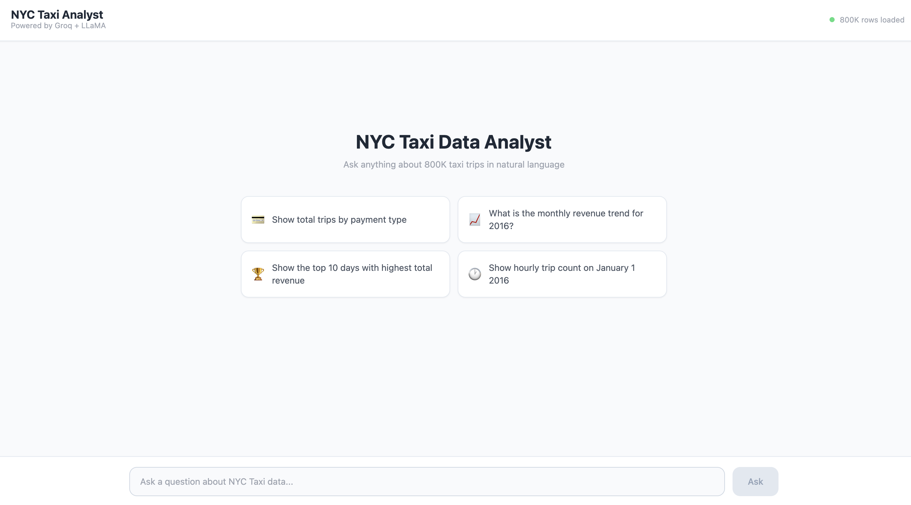
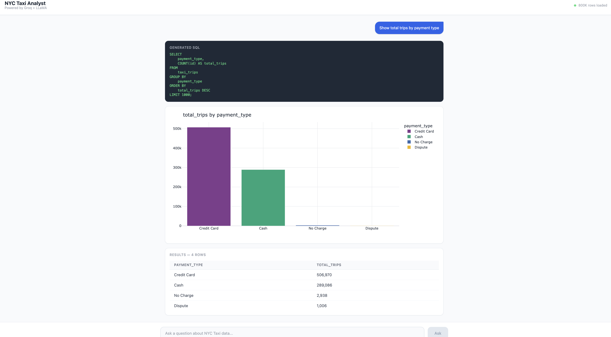
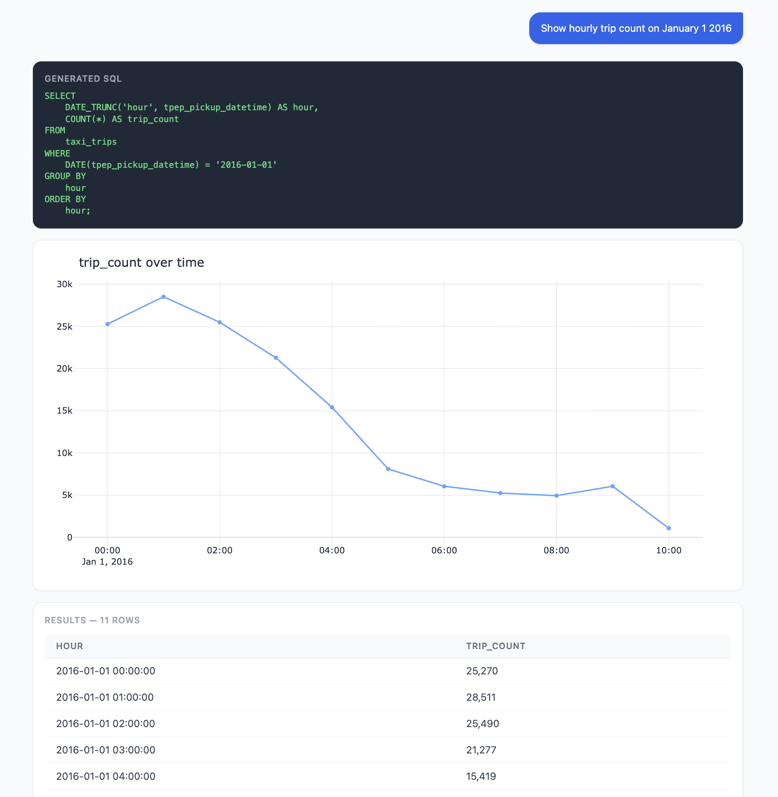
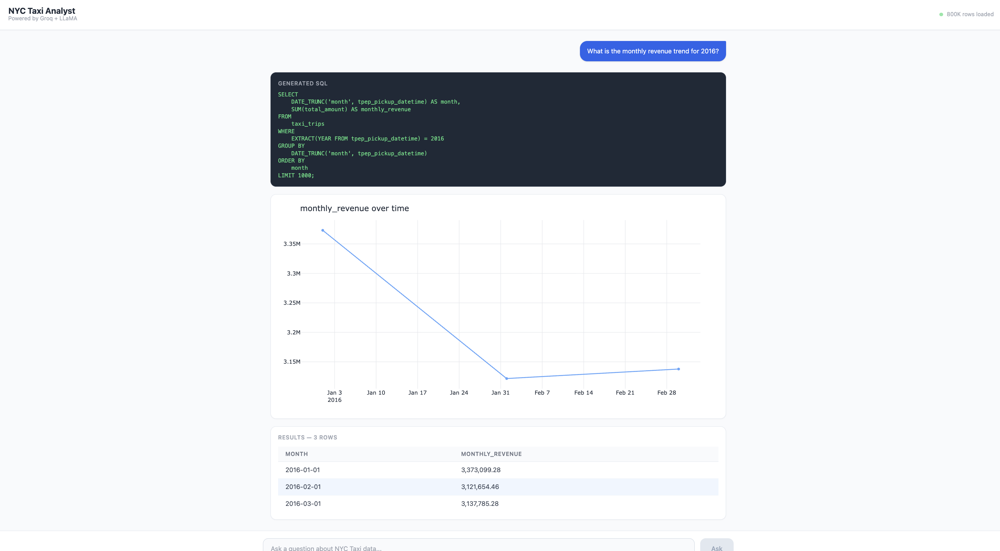
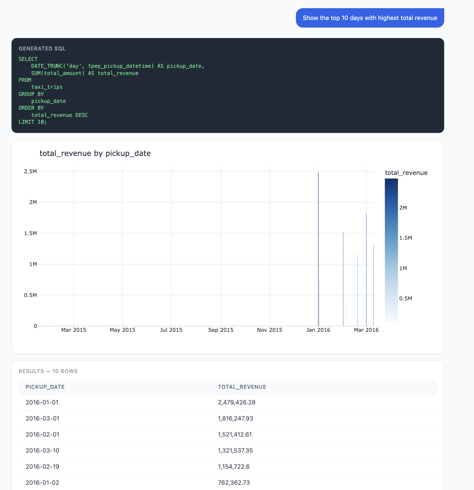

# NYC Taxi Data Analyst

A natural language to SQL query system for analyzing NYC Taxi trip data. Ask questions in plain English and get instant SQL queries, interactive charts, and data tables — no coding required.

> Powered by **Groq API (free)** · **LLaMA 3.3 70B** · **PostgreSQL** · **FastAPI** · **Next.js**

---

## Screenshots

### Home


### Trips by Payment Type


### Hourly Trip Count — Jan 1, 2016


### Monthly Revenue Trend


### Top 10 Highest Revenue Days


---

## Features

- **Natural Language to SQL** — Type a question, get accurate SQL instantly
- **Free LLM** — Uses Groq API with LLaMA 3.3 70B (no GPU, no cost)
- **Auto Visualization** — Automatically picks bar, line, or scatter chart based on data shape
- **Smart Labels** — Payment types, vendors, and rate codes shown as readable names (e.g. "Credit Card" not "1")
- **800K Rows** — NYC Taxi trip data from Jan 2015 to Mar 2016
- **Full Stack** — FastAPI backend + Next.js 14 frontend

---

## Skills & Tech Stack

### Frontend
| Tech | Usage |
|------|-------|
| **Next.js 14** | React framework with App Router |
| **TypeScript** | Type-safe components |
| **Tailwind CSS** | Utility-first styling |
| **Plotly / react-plotly.js** | Interactive charts |

### Backend
| Tech | Usage |
|------|-------|
| **FastAPI** | REST API framework |
| **SQLAlchemy** | Database ORM |
| **Pandas** | Data processing & cleaning |
| **Plotly Express** | Chart generation |
| **Python-dotenv** | Environment config |

### Database
| Tech | Usage |
|------|-------|
| **PostgreSQL** | Relational database (6.9GB taxi data) |
| **Docker** | Containerized DB setup |

### AI / LLM
| Tech | Usage |
|------|-------|
| **Groq API** | Free, fast LLM inference |
| **LLaMA 3.3 70B** | Natural language to SQL generation |
| **Prompt Engineering** | Schema injection + SQL rules in system prompt |
| **Ollama** (optional) | Local LLM fallback |

---

## How It Works

```
User Question
     │
     ▼
 Next.js Frontend  ──POST /query──▶  FastAPI Backend
                                          │
                              ┌───────────┼───────────┐
                              ▼           ▼           ▼
                          Groq API   PostgreSQL   Plotly
                         (SQL gen)   (execute)   (chart)
                              │           │           │
                              └───────────┴───────────┘
                                          │
                              SQL + Chart + Table
                                          │
                                          ▼
                                    Frontend UI
```

1. User types a question → frontend sends to `/query`
2. Backend calls **Groq API** → LLaMA 3.3 generates SQL
3. SQL executes on **PostgreSQL**
4. **Plotly** auto-generates chart based on data shape
5. SQL code, chart, and results table returned to frontend

**LLM Priority:** Groq API → Ollama (local, optional)

---

## Quick Start

### Prerequisites
- Python 3.10+
- Node.js 18+
- Docker Desktop
- Free Groq API key → [console.groq.com](https://console.groq.com)

---

### 1. Clone the repo

```bash
git clone https://github.com/AashiGoyani/LLM-based-Data-Analyst.git
cd LLM-based-Data-Analyst
```

### 2. Create `.env` file

```bash
# Database
POSTGRES_USER=admin
POSTGRES_PASSWORD=admin123
POSTGRES_DB=nyc_taxi
POSTGRES_HOST=127.0.0.1
POSTGRES_PORT=5432

# Groq API (free) — https://console.groq.com
GROQ_API_KEY=gsk_your_key_here

# Backend
BACKEND_HOST=0.0.0.0
BACKEND_PORT=8000
```

> If port 5432 is already in use, Docker maps to 5433. Set `POSTGRES_PORT=5433`.

### 3. Start the database

```bash
docker-compose up -d
```

### 4. Set up Python environment

```bash
python3 -m venv venv
source venv/bin/activate
pip install -r backend/requirements.txt
```

### 5. Load data

```bash
# Load 200K rows per file
python scripts/load_data.py --limit 200000

# Or load everything
python scripts/load_data.py
```

### 6. Start the backend

```bash
cd backend
source ../venv/bin/activate
uvicorn main:app --reload
```

Expected:
```
Using Groq API
INFO: Uvicorn running on http://127.0.0.1:8000
```

### 7. Start the frontend

```bash
cd frontend
npm install
npm run dev
```

### 8. Open the app

Go to **[http://localhost:3000](http://localhost:3000)**

---

## Example Queries

**Payment & Revenue**
- Show total trips by payment type
- What is the total revenue by payment type?
- Which payment type has the highest average tip?
- Show average fare amount by vendor

**Time Analysis**
- What is the monthly revenue trend for 2016?
- Show hourly trip count on January 1 2016
- What are the peak hours for taxi rides?
- Show total trips by day of week

**Rankings**
- Show the top 10 days with highest total revenue
- What are the top 10 highest fare trips in January 2016?
- Which vendor has higher average tips?

---

## Project Structure

```
├── backend/
│   ├── main.py              # FastAPI endpoints + chart generation
│   ├── llm_provider.py      # Groq / Ollama / OpenAI providers
│   └── requirements.txt
│
├── frontend/
│   └── app/
│       └── page.tsx         # Chat interface
│
├── scripts/
│   └── load_data.py         # CSV → PostgreSQL loader (chunked)
│
├── docker/
│   └── init.sql             # DB schema + indexes
│
├── model/
│   └── Modelfile            # Ollama model config (optional)
│
├── docs/
│   └── screenshots/         # App screenshots
│
├── docker-compose.yml

```

---

## Data

NYC Taxi & Limousine Commission (TLC) trip records — Jan 2015 to Mar 2016

| File | Period | Size |
|------|--------|------|
| `nyc_taxi.csv` | Jan 2015 | 1.9 GB |
| `yellow_tripdata_2016-01.csv` | Jan 2016 | 1.6 GB |
| `yellow_tripdata_2016-02.csv` | Feb 2016 | 1.7 GB |
| `yellow_tripdata_2016-03.csv` | Mar 2016 | 1.8 GB |

---

## Troubleshooting

**Database connection failed**
```bash
docker start nyc_taxi_db
# If port conflict → set POSTGRES_PORT=5433 in .env
```

**Port 8000 already in use**
```bash
lsof -ti :8000 | xargs kill -9
```

**Frontend won't start**
```bash
cd frontend && rm -rf node_modules .next && npm install && npm run dev
```
